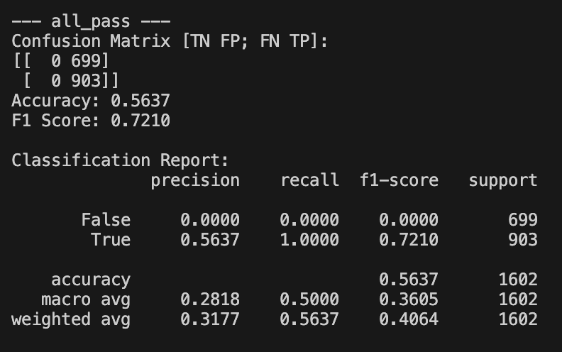
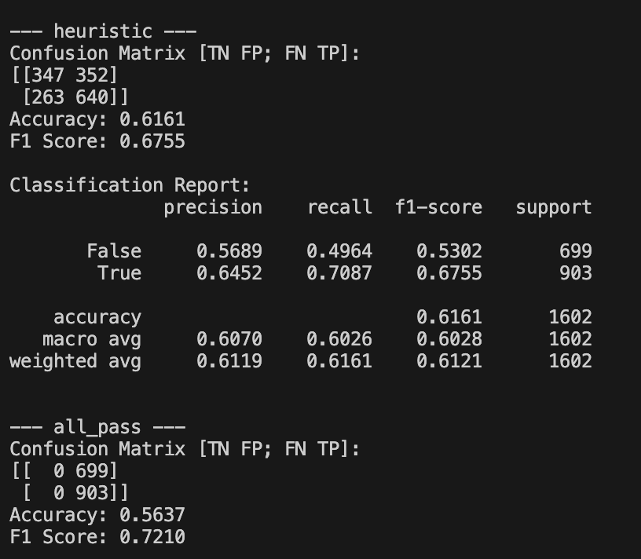
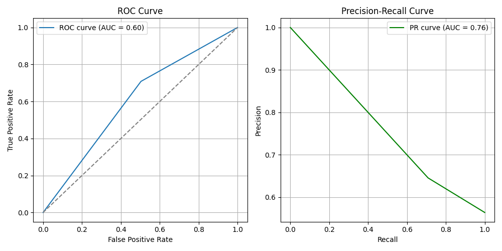
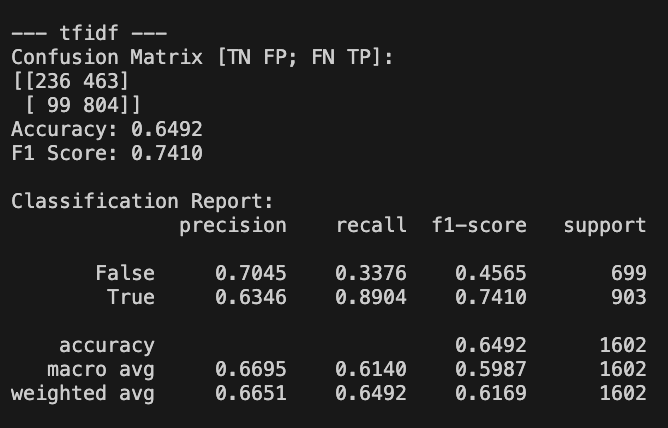
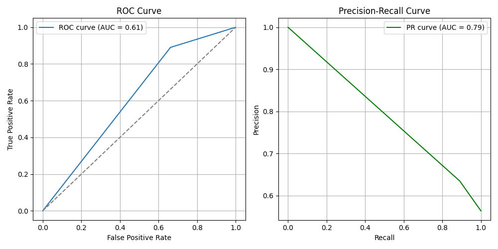

# First Draft of Final Project

Hahns Pena hpena02@calpoly.edu

Ishwarya Namburu inamburu@calpoly.edu

For our draft of our final project, we created a baseline, a hueristic, and a random forest model.

For our baseline, we chose to do an all pass classifier because in on our EDA we found that most movies pass. We plan to use this baseline to evaluate our model. Overall, this model has decent accuracy but it doesn't tell us anything about the movies that fail.

We also decided to try a heuristic based model, where a movie passes if its genre is not in our 
chosen genre list of Adventure, Action, Crime, War, Western, or History. We chose these genres based on the heatmap we generated during our EDA, where we found that these genres tended to be more male-centric. Our goal with our final model is to do better than both the baseline and heursitic.

For our final classifier, we are currently trying to use a random forest classifier with genres and tfidif of the concatenated overview, tagline, and title as features. Overall this classifier works decently well. Currently, our model has a higher F1 Score and accuracy than our heuristic and base line. However, our model still struggles to correctly getting the failing movies. 

Moving forward, we plan on trying out new features. We want to look into using the script to provide more words. We may use sentiment analysis to get more information on the word usage and bechdel pass/fail. Moving away from words, we may look more in detail with features such as year, female crew ratio, female cast ratio, popularity, and revenue. For now, we think random forest works for our model.

