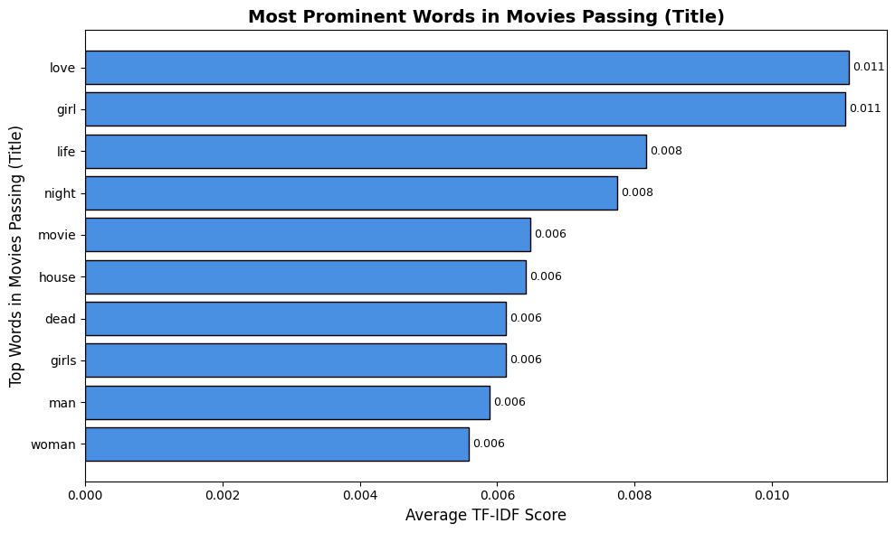
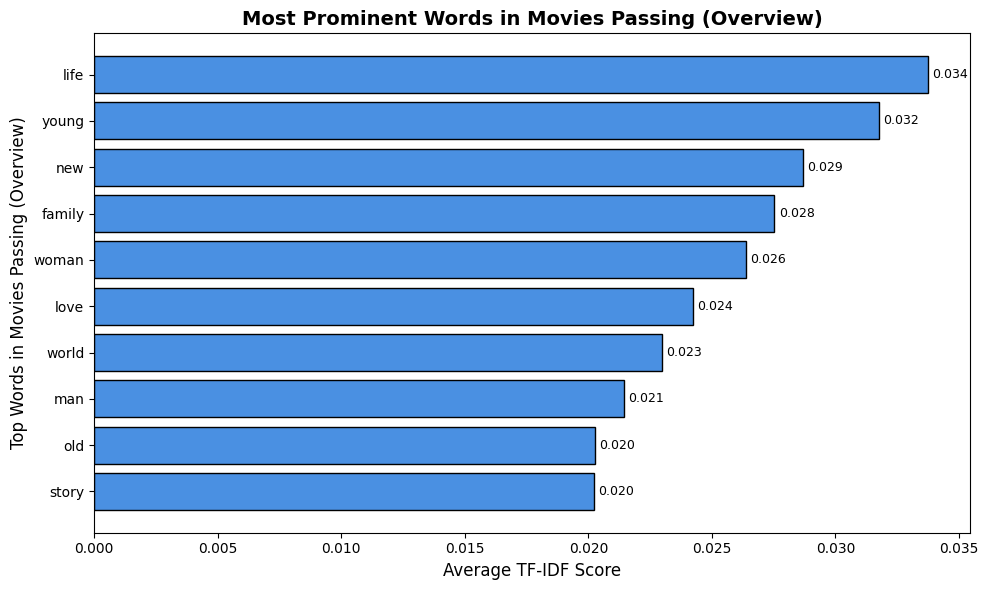
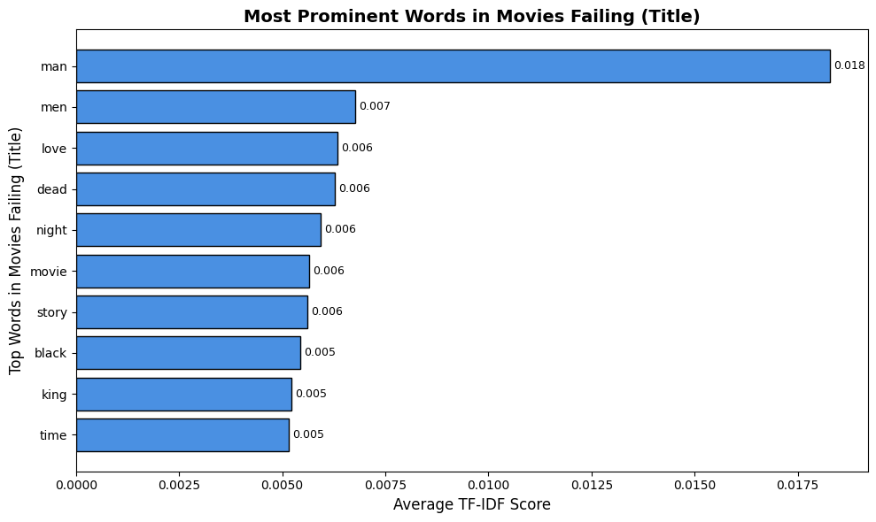
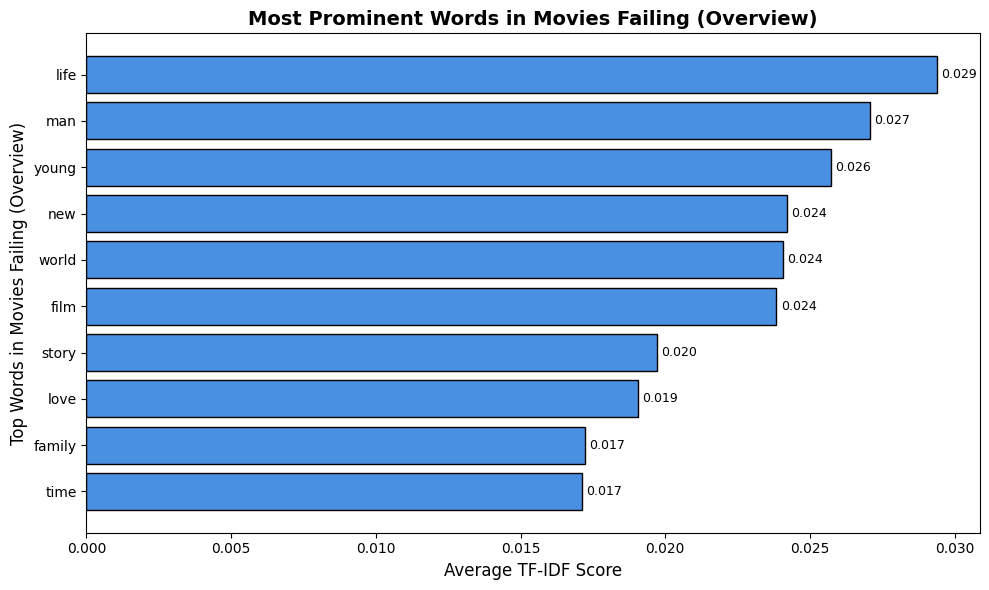

# Final Project Data Gathering + EDA 

### What is your dataset and why did you choose it?

Our project is based off the Bechdel Test. To pass the Bechdel Test, the movie has to have at least two named women in it who talk to each other about something besides a man. Our classifier would take a movie and use features of that movie to make the classification without actually using the script itself manually performing the test.

For our project, we've chosen a big movie dataset with over 45000 movies. 
https://www.kaggle.com/datasets/rounakbanik/the-movies-dataset?select=movies_metadata.csv 

For labeling reasons, we are using https://bechdeltest.com/ and their dataset so we have a bechdel rating.

We chose these datasets because they have a lot of movies and a lot of features. Our main concern was finding a dataset that labeled a large amount of movies. Thus, we needed to find a large dataset in the case we need to cut a good amount for labeling. With the bechdel and movie metadata datasets merged, we have 8000+ movies. It has very promising features such as "overview", "cast", and "tagline" which we plan on analyzing further within our EDA. This dataset also has a imdb_id column which is useful for merging with our ground truth dataset as well as our evluations.

As far as credibility goes, this Kaggle dataset is highly downloaded and highly rated. 

### What did you learn from your EDA?

**TF-IDF**
A major feature in our dataset that we wanted to look into was the words, specifically, the title, overview, and tagline. 

For movies that pass, common words are life, young, family, woman, and new. For movies that fail, common words are man, men, dead, night, story. Some of these word associations make sense, some more obvious than the other. However, a good amount of the words don't really have strong signals.

Unsuprisingly, love is at the top of both movies that pass and fail. It's possible that movies who have a love story sometimes don't have conversations between two women about not a man. 

Overall, these tfidf distributions could be useful for a classifier but there aren't very srong signals going on within them. Nevertheless, there are some strong signals, specifically the words "man" and "girl" so we may be able to use this for our classifier.

### What issues or open questions remain?

