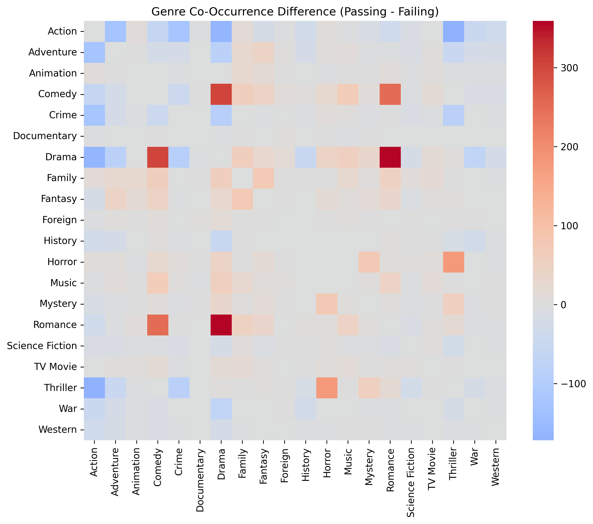
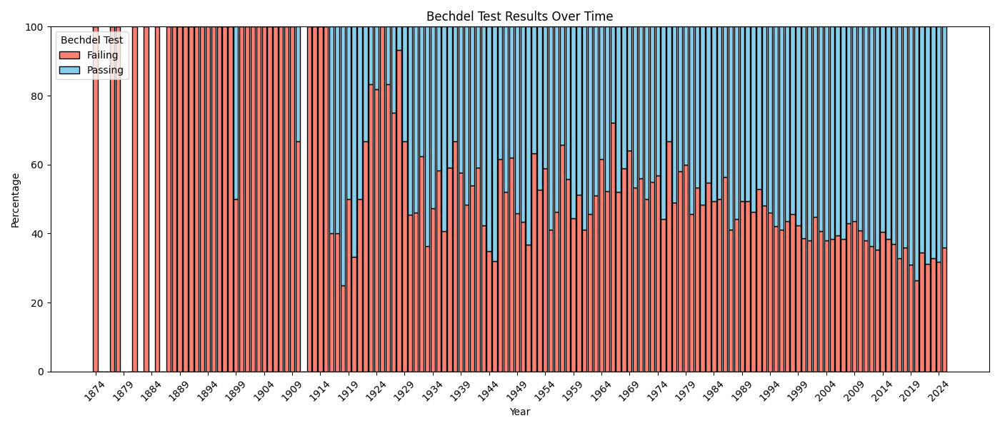
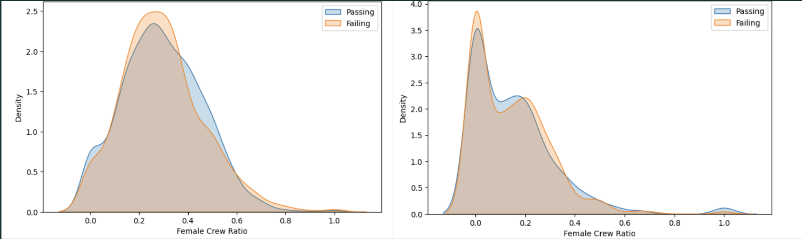
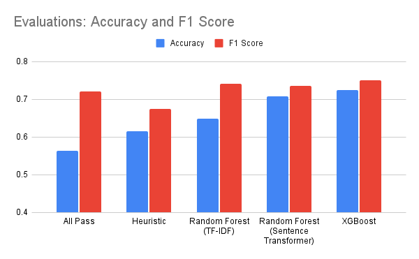
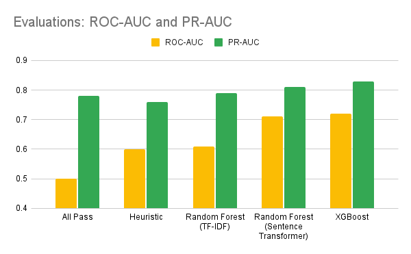

# Bechdel Test Classifier

Hahns Peña - hpena02@calpoly.edu

Ishwarya Namburu - inamburu@calpoly.edu

Presentation: https://docs.google.com/presentation/d/1lxitxX1k-Td8t_ShcBfSrFPdL_xv0tFA-qZXy_qHLNs/edit?usp=sharing

### The Bechdel Test

To pass the Bechdel Test, a movie must have at least two named women who talk to each other about something other than a man.

The Bechdel Test highlights the gender gap in media representation.This test proves that underrepresentation is a recurring trend in the industry, and encourages deeper discussions about unconscious bias.

### Dataset

We got our data from a kaggle movie dataset(https://www.kaggle.com/datasets/rounakbanik/the-movies-dataset?select=movies_metadata.csv) with feature such as genres, release date, popularity, cast, crew, ratings, movie metadata, and more. For our ground truth, we used data from this website(https://bechdeltest.com/) that has a list of movies that pass and fail the bechdel test.

### EDA

**Title / Overview / Taglines**

Our intuition for features began with the words in our dataset, specifically, the title, overview, and tagline. We decided to use TF-IDF.

.png>)
.png>)

Our TF-IDF reveals that there are, in fact, common words that are distinctly in pass or fail. Words such as “girl”, “woman”, and “family” are common in the passing movies. In contrast, words such as “world”, “war”, “film”, and “time” are common in the failing movies. Although these prevalent words are promising as a signal, we cannot rely on them because there are also words that commonly appear in both, such as “love”, “new”, “story”, and “young”. The results of the TF-IDF make sense and align with our assumptions.

Overall, these tfidf distributions give us insight that words are useful for a classifier. However, other methods of using the words prove to be more promising. Sentiment analysis and sentence transformers could be stronger signals because they can connect feminine and masculine words.

We decided to take it a step further and create a feature based on gendered keywords. These keywords include pronouns such as he/she/he/him and gendered language such as woman and man. The lack of feminine words in a movie was a strong signal of passing or failing.

**Genres**

Intuitively in current media there seem to be male centric and female centric genres. We wanted to see if this observed trend could be asserted through data.

The dark blue represents genre pairs that failed the most, and dark red represents genre pairs that passed. As hypothesized, genres with the highest fail rate seem to be action, crime, and adventure, and genres with the highest pass rate are romance, drama, and comedy.

**Year Released**
We were curious to see if release year played a role, because the representation of women was probably much lower years ago than it is now, and EDA proved that we were correct.

**Cast & Crew**

We were curious to see if underrepresentation in the cast and crew translated to underrepresentation in the actual movie. However, as you can see there was no clear trend to be observed.

**Models**
For this project, we created five models. Our models include:

1. All Pass - serves as a baseline for evaluation because most movies pass.
2. Heuristic - based on genre, our heuristic serves as a slightly better baseline
3. Random Forest (TF-IDF) - this model served as our first draft. It used TF-IDF and genres as our main features.
4. Random Forest (Sentence Transformer + Keyword) - this model improves upon TF-IDF and uses a hybrid of sentence transformer and keywords to pick up on more gendered nuance. This model also incorporates years ago.
5. Random Forest (Sentence Transformer + Keyword) - this model improves upon the previous model by using XGBoost instead of Random Forest

### Evaluations

Each model we created had increasing improvements as we modified our approach and prioritized the best improvements.

Ultimately, our final XGBoost performed the best. Our XGBoost model had a 0.16 increase in accuracy and a 0.03 increase in F1 score. This model also had a 0.22 increase in ROC-AUC and a 0.05 increase in PR-AUC. Overall, we’re pretty happy with our model as it properly classifies the majority of movies. Unfortunately, it struggles to classify movies with nuance, especially movies that sound like they would pass or fail at first glance. Movies like Barbie as Rapunzel were classified as failing because of all the feminine associations; however, they actually fail. Nevertheless, our classifier performs very well when there isn’t a lot of nuance.
